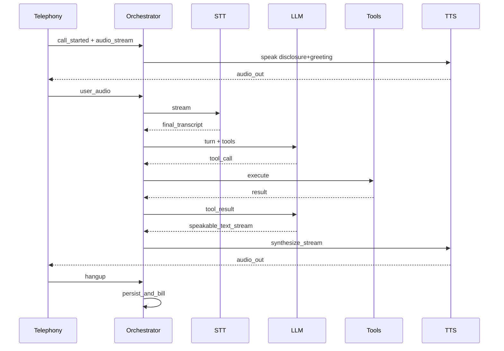

# 04 — Cascaded Agent Architecture

> **Implements:** Overview §4  
> **Outcome:** You can implement the realtime STT→LLM→TTS loop with barge-in, state, and latency budgets.

## 1. Two architectures

| Style | Pipeline | Pros | Cons |
| --- | --- | --- | --- |
| **Cascaded (default)** | Audio → STT → LLM(+tools) → TTS → Audio | Debuggable, swappable models, text tools | More hops; latency adds up |
| **Speech-to-speech / realtime** | Audio ↔ multimodal model (+ tools) | Often more natural; fewer stages | Harder text control/evals; vendor coupling |

**Implement cascaded first** unless you explicitly choose a speech-native API as your product bet.

```text
┌────────────┐   audio    ┌──────────────┐
│  Telephony │◄──────────►│ Orchestrator │
└────────────┘            └──────┬───────┘
                                 │
              ┌────────┬─────────┼─────────┬────────┐
              ▼        ▼         ▼         ▼        ▼
             VAD      STT       LLM      Tools     TTS
```

## 2. Session object (source of truth)

Keep one in-memory (or Redis) session per live call:

```text
CallSession
  call_id, tenant_id, agent_id
  state: enum (see §5)
  locale
  transcript: [{role, text, ts, final}]
  slots: map
  pending_tool_calls: []
  playback: {active, can_barge}
  timers: {no_input, max_call}
  cost_meters: {stt_ms, tts_chars, llm_tokens, tel_ms}
  flags: {disclosed_recording, verified_identity}
```

Persist durable facts on hangup; don’t require DB round-trips on every audio frame.

## 3. Hot path (per turn)

```text
1. Audio frames in
2. VAD updates speaking/silence
3. STT emits partials (optional: speculative LLM prep)
4. Endpointing decides "user turn ended"
5. Finalize user utterance text
6. Guardrails / state allows response?
7. LLM stream (may emit tool_call)
8. Execute tools (with timeout); feed results
9. LLM continues to speakable text
10. TTS stream frames → telephony playAudio
11. On barge-in at any time after step 10 started:
    - clearPlayback()
    - cancel TTS + cancel LLM if possible
    - return to listening
```

### Cancellation

Every async task needs a `AbortSignal` / `context.Context` cancel tied to `call_id` + `turn_id`. Stale TTS after barge-in is the #1 “robot won’t shut up” bug.

## 4. Latency budget

Target **p50 ~600–1200 ms** from end-of-user-speech → first agent audio.

| Stage | Budget | Engineering levers |
| --- | --- | --- |
| Endpointing | 200–600 ms | Tune silence threshold; don’t wait forever |
| STT finalize | 100–400 ms | Streaming ASR; avoid batch Whisper on hot path |
| LLM TTFT | 150–600 ms | Smaller model; short prompt; stream |
| TTS TTFB | 100–400 ms | Streaming TTS; sentence flush |
| Network | 50–200 ms | Colocate regions with CPaaS/STT/TTS |

### Streaming tactics that matter

1. **Sentence-flush TTS:** start speaking on first complete sentence, don’t wait for full LLM answer.  
2. **Partial STT speculative decode:** optional; only if you can cancel cheaply.  
3. **Tool fillers:** if tool >300–500 ms, either optimize tool or speak a short wait phrase *once* (avoid spam).  
4. **Warm connections:** keep HTTP/2 or WS pools to STT/TTS/LLM.

Instrument: `endpoint_ts`, `stt_final_ts`, `llm_first_token_ts`, `tts_first_byte_ts`, `audio_first_out_ts`.

## 5. State machine (minimal)

```text
INIT
  → DISCLOSE          # recording / AI disclosure if required
  → LISTEN
  → THINK             # LLM (+ tools)
  → SPEAK
  → LISTEN            # loop
  → TRANSFER | ACTION_SUCCESS | ACTION_FAIL | GOODBYE | ERROR
```

Rules:

- Only certain states allow TTS.  
- `LISTEN` accepts barge-in against `SPEAK`.  
- Max turns / max tool failures → `TRANSFER` or `GOODBYE`.  
- Never call side-effecting tools from `SPEAK` without confirmation state if high risk.

## 6. VAD, endpointing, barge-in

| Mechanism | Job | Tips |
| --- | --- | --- |
| VAD | Speech vs silence | Use provider VAD or lightweight local; telephony noise differs from headset |
| Endpointing | User finished turn | Combine silence ms + punctuation/semantic hints; language-specific |
| Barge-in | User interrupts agent | Threshold energy + STT partial confidence; ignore tiny blips |

**Barge-in policy knobs:**

- `min_ms_before_barge` (avoid cutting own greeting on echo)  
- `echo_cancellation` / ignore agent line if dual channel  
- `hard_stop_phrases` (“stop”, “agent”, “human”)  

## 7. Prompt & tool runtime

### Prompt packing (keep small)

1. System: persona, policies, output style for speech (short sentences)  
2. State: current state name + slots JSON  
3. Tools schema (only tools allowed in this state)  
4. Last N turns (not full hour call)  
5. Retrieval snippets only if needed  

**Speech style rules in system prompt:** no markdown, no long lists, confirm critical slots, one question at a time.

### Tool execution

```text
LLM → tool_call{name, args, call_id}
  → validate args against schema
  → check state allowlist
  → execute with timeout + idempotency_key
  → tool_result back to LLM
  → continue
```

On tool timeout: apologize once, retry once if safe, else escalate.

## 8. Speech-to-speech variant

If using a realtime multimodal API:

- Map telephony frames ↔ vendor session audio format.  
- Still keep your **state machine + tool allowlists** outside the model.  
- Persist vendor transcripts for evals.  
- Implement barge-in via vendor interrupt APIs + local playback clear.

Do not delete cascaded ports—you may need a fallback path.

## 9. Reference sequence (happy path)



## 10. Error handling matrix

| Failure | User-facing | System |
| --- | --- | --- |
| STT disconnect | “I’m having trouble hearing you…” | Failover STT or escalate |
| LLM 5xx | Brief apology + retry | Fallback model |
| TTS stall | Switch voice/provider or transfer | Circuit breaker |
| Tool 5xx | “System is slow…” | No silent inventing of results |
| >N no-input | Goodbye or callback offer | Close call; don’t loop forever |

## 11. Implementation checklist

- [ ] `CallSession` with cancel scopes per turn  
- [ ] Streaming STT partials + finals wired  
- [ ] Endpointing tunable  
- [ ] Barge-in clears playback and cancels TTS/LLM  
- [ ] Sentence-flush TTS  
- [ ] Tool allowlists by state  
- [ ] Latency timestamps exported  
- [ ] Max call duration enforced  
- [ ] Hangup finalizes meters + transcript  

## Next

→ [05 — Integrations](05-integrations.md)
